<div align="center">

# TestLoom 🎓
### *Next-Generation Educational Technology Platform*

[](https://vuejs.org/)
[](https://nuxt.com/)
[](https://nodejs.org/)
[](https://mongodb.com/)

**Transform your exam preparation with intelligent OCR technology, adaptive learning algorithms, and collaborative study environments.**


</div>

---

## 🌟 About TestLoom

TestLoom revolutionizes university exam preparation by combining cutting-edge OCR technology with intelligent learning algorithms. Our platform transforms scattered study materials into organized, interactive learning experiences that adapt to each student's unique needs.

### 🎯 **Why TestLoom?**

- **📈 98% Success Rate** - Students using TestLoom show significant improvement in exam performance
- **⚡ 70% Time Savings** - Streamlined study process with intelligent content organization
- **🔒 Enterprise Security** - Bank-grade security with encrypted data protection

---

## ✨ Key Features

<table>
<tr>
<td width="33%" align="center">

### 🔍 **Smart Question Bank**
Organized MCQs and fill-in-the-blank questions categorized by year, subject, and difficulty level with advanced filtering options.

</td>
<td width="33%" align="center">

### 📷 **OCR Integration**
Upload physical question papers and convert them into digital quizzes using advanced OCR technology with 95%+ accuracy.

</td>
<td width="33%" align="center">

### 🧠 **Adaptive Learning**
AI-powered personalized quizzes that adapt to your learning pace and identify knowledge gaps in real-time.

</td>
</tr>
<tr>
<td width="33%" align="center">

### 💬 **Collaborative Forums**
Community-driven discussion spaces for doubt-solving, resource sharing, and peer-to-peer learning support.

</td>
<td width="33%" align="center">

### 📊 **Performance Analytics**
Detailed insights into your study patterns, strengths, weaknesses, and progress tracking with visual dashboards.

</td>
<td width="33%" align="center">

### 🔐 **Secure & Scalable**
Enterprise-grade security with JWT authentication, data encryption, and infrastructure designed to handle thousands of users.

</td>
</tr>
</table>

---

## 🛠️ Technology Stack

<div align="center">

### **Frontend**


### **Backend**


### **Services & Tools**


</div>

---

## 🚀 Quick Start

### Prerequisites

Before you begin, ensure you have the following installed:
- **Node.js** (v20.x or higher)
- **MongoDB** (v6.x or higher)
- **Git**

### 📦 Installation

1. **Clone the repository**
   ```bash
   git clone https://github.com/shuv-amp/TestLoom.git
   cd TestLoom
   ```

2. **Install dependencies**
   ```bash
   # Install server dependencies
   cd server && npm install
   
   # Install client dependencies
   cd ../client && npm install
   ```
   
---

## 🏗️ Architecture Overview

```mermaid
graph TB
    subgraph Frontend["Frontend (User Experience)"]
        A[Vue.js 3 + Nuxt.js 3]
        style A fill:#ebf5fb,stroke:#3498db
    end
    
    subgraph Backend["Backend (Exam Logic)"]
        B[Node.js + Express.js]
        style B fill:#e8f8f5,stroke:#2ecc71
    end
    
    subgraph Database["Question Database"]
        C[(MongoDB + Mongoose<br>• Questions by year/subject<br>• User progress tracking)]
        style C fill:#fef9e7,stroke:#f1c40f
    end
    
    subgraph Features["Core Features"]
        F[Tesseract.js OCR<br>Physical → Digital Conversion]
        G[Socket.IO<br>Real-time Collaboration]
        H[Adaptive Quiz Engine<br>Performance Analytics]
        J[JWT Authentication<br>User Verification]
    end
    
    %% Primary connections
    A -->|API Requests| B
    B -->|CRUD Operations| C
    G -->|Live Updates| A
    G -->|Collaboration| B
    J -->|Secured Access| B
    J -->|Session Management| A
    F -->|Process Uploads| B
    H -->|Generates Quizzes| B
    B -->|Feeds Data| H
    
    class Features feature;
```

<div align="center">




</div>

---

## 📚 API Documentation

### 🔐 **Authentication Endpoints**
```http
POST /api/auth/register
POST /api/auth/login
POST /api/auth/refresh
POST /api/auth/logout
```

### 📝 **Question Management**
```http
GET    /api/questions?subject=math&difficulty=medium
POST   /api/questions
PUT    /api/questions/:id
DELETE /api/questions/:id
```

### 📊 **Analytics**
```http
GET /api/analytics/performance
GET /api/analytics/progress
GET /api/analytics/recommendations
```
---
</td>
</tr>
</table>

### 👥 **Our Amazing Contributors**

<a href="https://github.com/shuv-amp/TestLoom/graphs/contributors">
  
</a>
<div align="center">

[](https://github.com/shuv-amp/TestLoom/graphs/contributors)

</div>


## 🙋‍♂️ Support & Community

<div align="center">

### **Get Help & Connect**

[](mailto:shuvampandey1@gmail.com)

</div>

---

<div align="center">

[](https://github.com/shuv-amp/TestLoom)

**If TestLoom helps you ace your exams, consider giving us a ⭐️!**

</div>

