# TestLoom Developer Roadmap

---

## 📋 Executive Summary

TestLoom is a next-generation educational technology platform designed to revolutionize exam preparation for university students through intelligent OCR integration, adaptive learning algorithms, and collaborative study environments. This roadmap outlines a systematic 12-week development approach following industry best practices from leading tech companies.

### 🎯 Key Objectives
- **Academic Excellence**: Create an intuitive platform for effective exam preparation
- **Technical Innovation**: Leverage cutting-edge OCR and AI technologies
- **Scalable Architecture**: Build enterprise-grade, maintainable codebase
- **User Experience**: Deliver seamless, responsive, and accessible interface

---

## 🏗️ Technical Architecture Overview

### Core Technology Stack

```mermaid
graph TB
    subgraph Frontend["Frontend (User Experience)"]
        A[Vue.js 3 + Nuxt.js 3]
        style A fill:#ebf5fb,stroke:#3498db
    end
    
    subgraph Backend["Backend (Exam Logic)"]
        B[Node.js + Express.js]
        style B fill:#e8f8f5,stroke:#2ecc71
    end
    
    subgraph Database["Question Database"]
        C[(MongoDB + Mongoose<br>• Questions by year/subject<br>• User progress tracking)]
        style C fill:#fef9e7,stroke:#f1c40f
    end
    
    subgraph Features["Core Features"]
        F[Tesseract.js OCR<br>Physical → Digital Conversion]
        G[Socket.IO<br>Real-time Collaboration]
        H[Adaptive Quiz Engine<br>Performance Analytics]
        J[JWT Authentication<br>User Verification]
    end
    
    %% Primary connections
    A -->|API Requests| B
    B -->|CRUD Operations| C
    G -->|Live Updates| A
    G -->|Collaboration| B
    J -->|Secured Access| B
    J -->|Session Management| A
    F -->|Process Uploads| B
    H -->|Generates Quizzes| B
    B -->|Feeds Data| H
    
    classDef feature fill:#f4ecf7,stroke:#9b59b6;
    class Features feature;
```


### System Architecture Principles
- **Microservices Ready**: Modular design for future scalability
- **API-First**: RESTful APIs with GraphQL consideration
- **Security by Design**: Zero-trust architecture implementation
- **Performance Optimized**: Caching strategies and CDN integration

---

## 📅 Development Timeline

### Phase 1: Foundation & Infrastructure 
**Objective**: Establish robust development environment and core architecture

#### Week 1: Project Setup & Development Environment
- [ ] **Repository Structure**
  ```
  testloom/
  ├── client/                 # Nuxt.js frontend
  ├── server/                 # Node.js backend
  ├── shared/                 # Shared utilities/types
  ├── docs/                   # Documentation
  ├── scripts/               # Build/deployment scripts
  └── infrastructure/        # IaC templates
  ```

#### Week 2: Core Infrastructure
- [ ] **Backend Foundation**
  ```javascript
  // server/src/app.js - Express application setup
  const express = require('express');
  const helmet = require('helmet');
  const cors = require('cors');
  const rateLimit = require('express-rate-limit');
  
  const app = express();
  
  // Security middleware
  app.use(helmet());
  app.use(cors(corsOptions));
  app.use(rateLimit(rateLimitConfig));
  ```

- [ ] **Database Design**
  ```javascript
  // MongoDB Collections Schema
  const UserSchema = {
    _id: ObjectId,
    email: String, // unique, indexed
    password: String, // bcrypt hashed
    profile: {
      firstName: String,
      lastName: String,
      university: String,
      major: String,
      yearOfStudy: Number
    },
    preferences: {
      theme: String,
      notifications: Boolean,
      language: String
    },
    subscription: {
      plan: String, // free, premium, pro
      expiresAt: Date,
      features: [String]
    },
    createdAt: Date,
    updatedAt: Date
  };
  ```

- [ ] **Authentication System**
  - JWT token implementation
  - Refresh token rotation
  - OAuth2 integration (Google/Microsoft)
  - Password reset functionality
  - Account verification system

### Phase 2: Core Features Development 

#### Week 3: User Management & Authentication
- [ ] **Frontend Authentication**
  ```vue
  <!-- components/auth/LoginForm.vue -->
  <template>
    <form @submit.prevent="handleLogin" class="auth-form">
      <div class="form-group">
        <input
          v-model="credentials.email"
          type="email"
          placeholder="Email"
          required
          class="form-input"
        />
      </div>
      <!-- Additional form fields -->
    </form>
  </template>
  ```

- [ ] **API Endpoints**
  ```javascript
  // server/routes/auth.js
  POST   /api/auth/register
  POST   /api/auth/login
  POST   /api/auth/refresh
  POST   /api/auth/logout
  POST   /api/auth/forgot-password
  POST   /api/auth/reset-password
  GET    /api/auth/verify/:token
  ```

- [ ] **User Profile Management**
  - Profile creation/editing
  - Avatar upload system
  - Preference management
  - Account deletion/deactivation

#### Week 4: Question Bank Foundation
- [ ] **Database Schema**
  ```javascript
  const QuestionSchema = {
    _id: ObjectId,
    title: String,
    content: String, // Rich text/HTML
    type: String, // mcq, essay, fill-blank, true-false
    difficulty: Number, // 1-5 scale
    subject: ObjectId, // Reference to Subject
    topics: [String],
    options: [{
      text: String,
      isCorrect: Boolean,
      explanation: String
    }],
    explanation: String,
    points: Number,
    timeLimit: Number, // seconds
    createdBy: ObjectId, // User reference
    isVerified: Boolean,
    metadata: {
      source: String,
      chapter: String,
      examType: String
    },
    analytics: {
      timesAnswered: Number,
      correctRate: Number,
      averageTime: Number
    },
    createdAt: Date,
    updatedAt: Date
  };
  ```

- [ ] **Question Management APIs**
  ```javascript
  GET    /api/questions?filter&sort&page
  POST   /api/questions
  GET    /api/questions/:id
  PUT    /api/questions/:id
  DELETE /api/questions/:id
  POST   /api/questions/:id/flag
  GET    /api/questions/subjects/:subjectId
  ```

#### Week 5: OCR Integration
- [ ] **OCR Service Implementation**
  ```javascript
  // server/services/ocrService.js
  class OCRService {
    async processImage(imageBuffer, options = {}) {
      try {
        // Tesseract.js for basic OCR
        const basicResult = await tesseract.recognize(imageBuffer);
        
        // Google Vision API for advanced processing
        if (options.useAdvanced) {
          const advancedResult = await this.googleVisionOCR(imageBuffer);
          return this.mergeResults(basicResult, advancedResult);
        }
        
        return this.formatResult(basicResult);
      } catch (error) {
        throw new OCRProcessingError(error.message);
      }
    }
  }
  ```

- [ ] **File Upload System**
  - Multer integration
  - Image preprocessing
  - File validation
  - Cloud storage (AWS S3)
  - Progress tracking

### Phase 3: Advanced Features 

#### Week 6: Quiz Generation & Management
- [ ] **Quiz Engine**
  ```javascript
  const QuizSchema = {
    _id: ObjectId,
    title: String,
    description: String,
    questions: [{
      questionId: ObjectId,
      points: Number,
      timeLimit: Number
    }],
    settings: {
      shuffleQuestions: Boolean,
      shuffleOptions: Boolean,
      allowReview: Boolean,
      showCorrectAnswers: Boolean,
      passingScore: Number
    },
    timeLimit: Number, // Total quiz time
    attempts: {
      maxAttempts: Number,
      cooldownPeriod: Number
    },
    scheduling: {
      startDate: Date,
      endDate: Date,
      timezone: String
    },
    createdBy: ObjectId,
    isPublic: Boolean,
    tags: [String],
    createdAt: Date
  };
  ```

- [ ] **Adaptive Quiz Algorithm**
  ```javascript
  class AdaptiveQuizEngine {
    calculateNextQuestion(userPerformance, questionPool) {
      const difficulty = this.estimateUserAbility(userPerformance);
      const candidates = this.filterByDifficulty(questionPool, difficulty);
      return this.selectOptimalQuestion(candidates, userPerformance);
    }
    
    estimateUserAbility(responses) {
      // Item Response Theory implementation
      return this.calculateTheta(responses);
    }
  }
  ```

#### Week 7: Real-time Collaboration
- [ ] **Socket.IO Integration**
  ```javascript
  // server/socket/socketHandler.js
  io.on('connection', (socket) => {
    socket.on('join-study-room', (roomId) => {
      socket.join(roomId);
      socket.to(roomId).emit('user-joined', socket.userId);
    });
    
    socket.on('share-question', (data) => {
      socket.to(data.roomId).emit('question-shared', data);
    });
  });
  ```

- [ ] **Study Rooms Feature**
  - Real-time question sharing
  - Voice/video integration prep
  - Collaborative whiteboards
  - Screen sharing capabilities

#### Week 8: Performance Analytics
- [ ] **Analytics Dashboard**
  ```vue
  <!-- pages/analytics/dashboard.vue -->
  <template>
    <div class="analytics-dashboard">
      <PerformanceChart :data="performanceData" />
      <SubjectBreakdown :subjects="subjectAnalytics" />
      <ProgressTracker :milestones="userMilestones" />
    </div>
  </template>
  ```

- [ ] **Data Processing Pipeline**
  ```javascript
  class AnalyticsEngine {
    async generateUserReport(userId, timeRange) {
      const activities = await this.getUserActivities(userId, timeRange);
      const performance = await this.calculatePerformanceMetrics(activities);
      const insights = await this.generateInsights(performance);
      
      return {
        summary: performance,
        insights: insights,
        recommendations: this.generateRecommendations(performance)
      };
    }
  }
  ```

### Phase 4: User Experience & Polish (Weeks 9-10)

#### Week 9: Frontend Polish & Optimization
- [ ] **UI/UX Enhancements**
  ```vue
  <!-- layouts/default.vue -->
  <template>
    <div class="app-layout">
      <Sidebar v-if="$auth.loggedIn" />
      <main class="main-content">
        <TopNavigation />
        <Nuxt />
      </main>
      <NotificationSystem />
    </div>
  </template>
  
  <style scoped>
  .app-layout {
    @apply min-h-screen bg-gray-50 dark:bg-gray-900;
    display: grid;
    grid-template-columns: auto 1fr;
  }
  </style>
  ```

- [ ] **Performance Optimization**
  - Lazy loading implementation
  - Image optimization
  - Bundle splitting
  - Service worker caching
  - Core Web Vitals optimization

#### Week 10: Mobile Responsiveness
- [ ] **Progressive Web App**
  ```javascript
  // nuxt.config.js
  export default {
    pwa: {
      icon: {
        source: '/icon.png',
        fileName: 'icon.png'
      },
      manifest: {
        name: 'TestLoom',
        short_name: 'TestLoom',
        theme_color: '#3b82f6'
      },
      workbox: {
        offline: true,
        cacheAssets: true
      }
    }
  }
  ```

- [ ] **Touch Optimizations**
  - Gesture support
  - Touch-friendly interfaces
  - Mobile-first design
  - Offline capabilities

### Phase 5: Testing & Quality Assurance (Week 11)

#### Comprehensive Testing Strategy
- [ ] **Unit Testing**
  ```javascript
  // tests/unit/auth.test.js
  describe('Authentication Service', () => {
    test('should validate JWT tokens correctly', async () => {
      const token = generateTestToken();
      const result = await authService.validateToken(token);
      expect(result.isValid).toBe(true);
    });
  });
  ```

- [ ] **Integration Testing**
  ```javascript
  // tests/integration/api.test.js
  describe('Question API', () => {
    test('should create question with valid data', async () => {
      const response = await request(app)
        .post('/api/questions')
        .send(validQuestionData)
        .expect(201);
      
      expect(response.body).toHaveProperty('_id');
    });
  });
  ```

- [ ] **E2E Testing**
  ```javascript
  // tests/e2e/user-journey.spec.js
  test('complete user journey', async ({ page }) => {
    await page.goto('/login');
    await page.fill('[data-testid=email]', 'test@example.com');
    await page.click('[data-testid=login-btn]');
    await expect(page).toHaveURL('/dashboard');
  });
  ```

---

## 🔒 Security Implementation

### Authentication & Authorization
```javascript
// Security middleware stack
const securityMiddleware = [
  helmet({
    contentSecurityPolicy: {
      directives: {
        defaultSrc: ["'self'"],
        styleSrc: ["'self'", "'unsafe-inline'", "fonts.googleapis.com"],
        fontSrc: ["'self'", "fonts.gstatic.com"],
        imgSrc: ["'self'", "data:", "https:"],
        scriptSrc: ["'self'"]
      }
    }
  }),
  cors({
    origin: process.env.ALLOWED_ORIGINS?.split(','),
    credentials: true
  }),
  rateLimit({
    windowMs: 15 * 60 * 1000, // 15 minutes
    max: 100 // requests per window
  })
];
```

### Data Protection
- **Encryption**: AES-256 for sensitive data
- **Input Validation**: Joi/Zod schema validation
- **SQL Injection Prevention**: Mongoose ODM protection
- **XSS Protection**: Content Security Policy
- **CSRF Protection**: Double-submit cookies

---

## 🚀 Performance Optimization

### Frontend Optimization
```javascript
// nuxt.config.js performance config
export default {
  build: {
    optimization: {
      splitChunks: {
        chunks: 'all',
        cacheGroups: {
          vendor: {
            test: /[\\/]node_modules[\\/]/,
            name: 'vendors',
            chunks: 'all'
          }
        }
      }
    }
  },
  render: {
    resourceHints: false,
    http2: {
      push: true
    }
  }
}
```

### Backend Optimization
```javascript
// Redis caching strategy
class CacheService {
  async get(key) {
    const cached = await redis.get(key);
    return cached ? JSON.parse(cached) : null;
  }
  
  async set(key, data, ttl = 3600) {
    await redis.setex(key, ttl, JSON.stringify(data));
  }
  
  async invalidatePattern(pattern) {
    const keys = await redis.keys(pattern);
    if (keys.length > 0) {
      await redis.del(keys);
    }
  }
}
```

---

## 📊 Monitoring & Analytics

### Application Monitoring
```javascript
// Health check endpoint
app.get('/health', async (req, res) => {
  const health = {
    status: 'healthy',
    timestamp: new Date().toISOString(),
    services: {
      database: await checkDatabaseHealth(),
      redis: await checkRedisHealth(),
      storage: await checkStorageHealth()
    }
  };
  
  res.status(200).json(health);
});
```

### Error Tracking
```javascript
// Error handling middleware
app.use((error, req, res, next) => {
  logger.error({
    error: error.message,
    stack: error.stack,
    url: req.url,
    method: req.method,
    ip: req.ip,
    userAgent: req.get('User-Agent')
  });
  
  // Send to monitoring service
  errorTracker.captureException(error, {
    user: req.user,
    extra: { requestId: req.id }
  });
  
  res.status(500).json({
    error: 'Internal Server Error',
    requestId: req.id
  });
});
```

---

## 🔮 Future Enhancements Roadmap

### Phase 6: AI & Machine Learning
- **Intelligent Question Generation**: GPT-4 integration
- **Personalized Learning Paths**: ML recommendation engine
- **Automated Grading**: NLP-based essay evaluation
- **Predictive Analytics**: Performance forecasting

### Phase 7: Advanced Integrations 
- **LMS Integration**: Canvas, Moodle, Blackboard
- **University APIs**: Grade sync, course catalogs
- **Social Learning**: Study groups, peer tutoring
- **Gamification**: Achievement system, leaderboards

### Phase 8: Enterprise Features 
- **Multi-tenancy**: Institution-specific deployments
- **Advanced Analytics**: Institutional dashboards
- **API Marketplace**: Third-party integrations
- **White-label Solutions**: Custom branding options

---

## 📚 Resources & Documentation

### Technical Documentation
- [API Documentation](./docs/api/)
- [Database Schema](./docs/database/)
- [Deployment Guide](./docs/deployment/)

### Learning Resources
- [Vue.js 3 Documentation](https://vuejs.org/)
- [Nuxt.js 3 Guide](https://nuxt.com/)
- [Node.js Best Practices](https://github.com/goldbergyoni/nodebestpractices)
- [MongoDB University](https://university.mongodb.com/)

---

*This roadmap represents a comprehensive approach to building TestLoom. Regular reviews and updates will ensure alignment with evolving requirements and industry best practices.*
