# 
📚 TestLoom

**Revolutionizing University Exam Preparation**

*A centralized, intelligent platform for collaborative learning*

---

---

## 🌟 Vision

TestLoom transforms scattered exam preparation into a **unified, intelligent learning ecosystem** where students collaborate, practice, and excel together. No more hunting through fragmented resources—everything you need is here.

---

## ✨ Core Features

<table>
<tr>
<td width="50%">

### 🎯 **Smart Question Bank**
- **Organized by semester, subject & chapter**
- Multiple-choice & fill-in-the-blank questions
- Difficulty-based categorization
- Crowd-sourced content expansion

</td>
<td width="50%">

### 🤖 **AI-Powered OCR**
- **Upload physical papers instantly**
- Tesseract.js + Google Vision API
- Automatic question extraction
- Format conversion to digital quizzes

</td>
</tr>
<tr>
<td width="50%">

### 🔒 **Enterprise Security**
- **JWT-based authentication (RS256)**
- Role-based access control
- Secure session management
- Data privacy compliance

</td>
<td width="50%">

### ⚡ **Real-Time Collaboration**
- **Socket.IO powered discussions**
- Live peer interactions
- Instant doubt resolution
- Community-driven learning

</td>
</tr>
<tr>
<td width="50%">

### 🧠 **Adaptive Intelligence**
- **Performance-based difficulty**
- Personalized learning paths
- Smart question recommendations
- Timed practice sessions

</td>
<td width="50%">

### 📊 **Analytics Dashboard**
- **Comprehensive progress tracking**
- Performance insights
- Strength/weakness analysis
- Achievement milestones

</td>
</tr>
</table>

---

## 🏗️ Architecture

```mermaid
graph TB
    A[👤 Student] --> B[🌐 Nuxt.js Frontend]
    B --> C[🔗 Express.js API]
    C --> D[🗄️ MongoDB Database]
    C --> E[🔐 JWT Auth]
    C --> F[⚡ Socket.IO]
    C --> G[🤖 OCR Services]
    G --> H[📷 Tesseract.js]
    G --> I[☁️ Google Vision]
    
```

---

## 🛠️ Technology Stack

| Layer | Technology | Purpose |
|-------|------------|---------|
| **🨠Frontend** |   | Responsive UI/UX |
| **⚙️ Backend** |   | Scalable API |
| **🗄️ Database** |  | NoSQL Storage |
| **🔠Auth** |  | Secure Access |
| **⚡ Real-time** |  | Live Communication |
| **🤖 OCR** |   | Image Processing |

---

## 🚀 Quick Navigation

| 📋 **Documentation**                                                             | 📊 **Resources**                                                       |
| :------------------------------------------------------------------------------- | :--------------------------------------------------------------------- |
| [🏗️ **Architecture Overview**](./architecture.md) System design & components | [📚 **API Reference**](./api/) Complete endpoint docs               |
| [👤 **User Flows**](./diagrams/user-flow.md) Interaction diagrams             | [🗄️ **Database Schema**](./database-schema.md) MongoDB collections |

