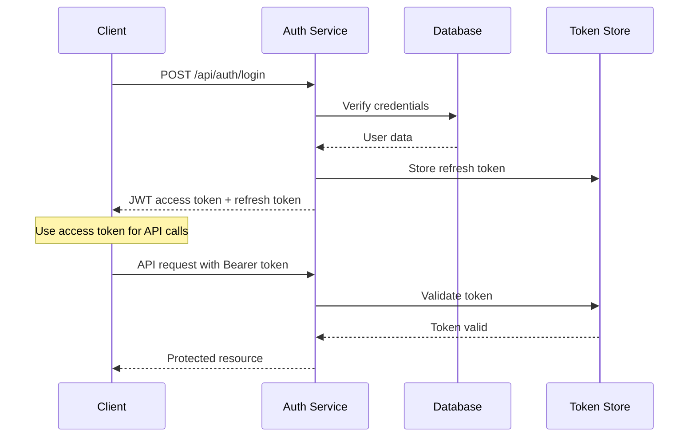

# 🔐 Authentication API

## Overview

TestLoom uses JWT (JSON Web Tokens) for secure authentication with role-based access control. The system supports student and moderator roles with different permission levels.

## Authentication Flow

## Security Features

### Token Security

- **Access Token**: JWT, expires in 15 minutes (recommended short lifespan)
- **Refresh Token**: Random string, expires in 7 days (reduced from 30 days for security)  
- **Reset Token**: Random string, expires in 1 hour
- **JWT Algorithm**: RS256 (RSA with SHA-256) for enhanced security

### Password Requirements

- Minimum 8 characters
- At least 1 uppercase letter
- At least 1 lowercase letter  
- At least 1 number
- At least 1 special character (!@#$%^&*)

### Account Security

- Automatic account lockout after 5 failed attempts (industry standard)
- Account unlock after 15 minutes or admin intervention
- Password history: Last 5 passwords cannot be reused
- Session timeout after 24 hours of inactivity

