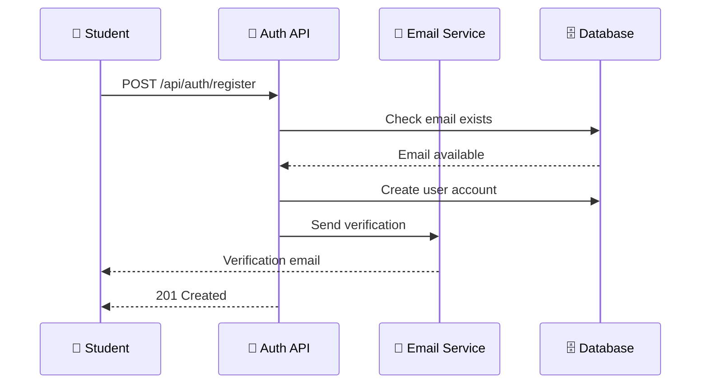
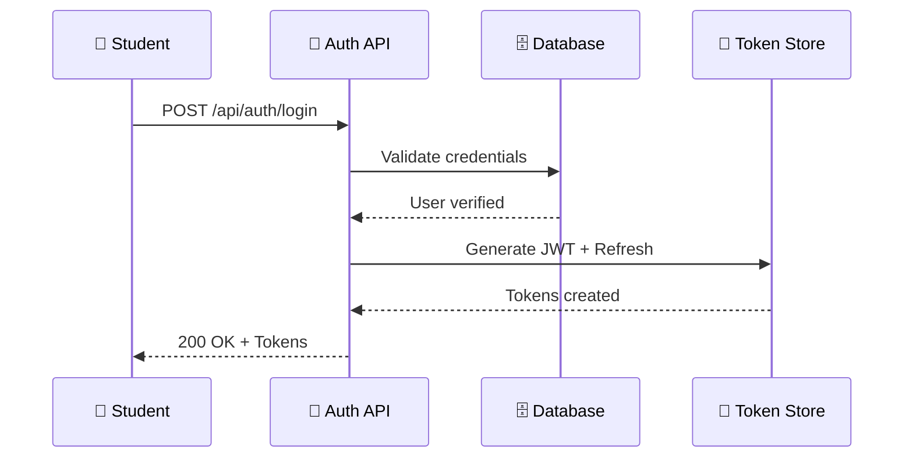

# <div align="center">🔐 Authentication API Reference</div>

<div align="center">

**Secure Access to TestLoom's Educational Platform**

*Complete API endpoints for student authentication and session management*

---


</div>

---

## 🌟 API Overview

TestLoom's Authentication API provides **secure, simple endpoints** for student registration, login, and session management. Built for university-grade security with developer-friendly responses.

### 🎯 **Quick Navigation**

<table>
<tr>
<td width="25%" align="center">

### 📝 **Registration**
Create new student accounts with university email validation

</td>
<td width="25%" align="center">

### 🔑 **Login**
Secure authentication with JWT token generation

</td>
<td width="25%" align="center">

### 🔄 **Token Refresh**
Seamless session management without re-authentication

</td>
<td width="25%" align="center">

### 🚪 **Logout**
Secure session termination and token invalidation

</td>
</tr>
</table>

---

## 🚀 Endpoint Overview

<div align="center">

| 🎯 Endpoint            | 📱 Method | 🛡️ Auth Required     | 📝 Purpose               |
|:-----------------------|:---------:|:--------------------:|:-------------------------|
| `/api/auth/register`   | POST      | ❌ None              | Create student account   |
| `/api/auth/login`      | POST      | ❌ None              | Authenticate user        |
| `/api/auth/refresh`    | POST      | 🔄 Refresh Token     | Get new access token     |
| `/api/auth/logout`     | POST      | 🎫 Bearer Token      | End user session         |
| `/api/auth/me`         | GET       | 🎫 Bearer Token      | Get user profile         |
</div>

---

## 📝 Student Registration

### `POST /api/auth/register`

Create a new TestLoom student account with university email verification.

<div align="center">



</div>

## 🔑 Student Login

### `POST /api/auth/login`

Authenticate students and receive access tokens for TestLoom platform.

<div align="center">



</div>

#### 📋 **Request Format**

```http
POST /api/auth/login
Content-Type: application/json

{
  "email": "student@student.ku.edu.np",
  "password": "Secure123!"
}
```

#### ✅ **Success Response**

```http
HTTP/1.1 200 OK
Content-Type: application/json

{
  "success": true,
  "message": "Login successful",
  "data": {
    "accessToken": "at_123456...",
    "refreshToken": "rt_123456...",
    "expiresIn": 900,
    "user": {
      "id": "43b4353j53k43k434f",
      "email": "student@student.ku.edu.np",
      "firstName": "first_name",
      "lastName": "second_name",
      "role": "student",
      "semester": 3,
      "verified": true
    }
  }
}
```

#### 🚨 **Error Responses**

<table>
<tr>
<td width="30%">

**401 Unauthorized**
```json
{
  "success": false,
  "error": "INVALID_CREDENTIALS",
  "message": "Invalid email or password"
}
```

</td>
<td width="30%">

**423 Locked**
```json
{
  "success": false,
  "error": "ACCOUNT_LOCKED",
  "message": "Account locked due to failed attempts",
  "unlockAt": "2025-05-05T11:21:23Z"
}
```

</td>
<td width="30%">

**403 Forbidden**
```json
{
  "success": false,
  "error": "EMAIL_NOT_VERIFIED",
  "message": "Please verify your email first"
}
```

</td>
</tr>
</table>

---

## 🔄 Token Refresh

### `POST /api/auth/refresh`

Get new access tokens without re-authentication for seamless user experience.

#### 📋 **Request Format**

```http
POST /api/auth/refresh
Content-Type: application/json

{
  "refreshToken": "rt_123456..."
}
```

#### ✅ **Success Response**

```http
HTTP/1.1 200 OK
Content-Type: application/json

{
  "success": true,
  "message": "Token refreshed successfully",
  "data": {
    "accessToken": "at_654321...",
    "refreshToken": "rt_654321...",
    "expiresIn": 900
  }
}
```

---

## 🚪 Secure Logout

### `POST /api/auth/logout`

Safely terminate user sessions and invalidate all tokens.

#### ✅ **Success Response**

```http
HTTP/1.1 200 OK
Content-Type: application/json

{
  "success": true,
  "message": "Logged out successfully"
}
```

---

## 👤 User Profile

### `GET /api/auth/me`

Retrieve current user's profile information and session details.

#### ✅ **Success Response**

```http
HTTP/1.1 200 OK
Content-Type: application/json

{
  "success": true,
  "data": {
    "user": {
      "id": "43b4353j53k43k434f",
      "email": "student@student.ku.edu.np",
      "firstName": "first_name",
      "lastName": "second_name",
      "role": "student",
      "semester": 3,
      "verified": true,
      "lastLogin": "2025-05-05T11:25:00Z",
      "preferences": {
        "theme": "light",
        "notifications": true
      }
    }
  }
}
```
