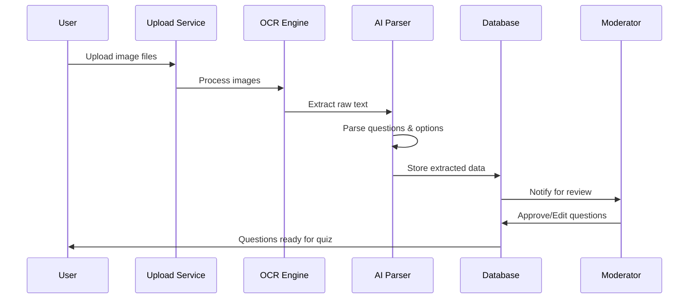

# 📷 OCR API

## Overview

The OCR (Optical Character Recognition) API enables automatic extraction of text and questions from uploaded images. It uses advanced AI models to recognize handwritten and printed text, specifically optimized for educational content.

## OCR Processing Flow

## Quality Assurance

### Image Quality Requirements

- **Resolution**: Minimum 300 DPI recommended
- **Format**: JPG, PNG, PDF, TIFF supported
- **Size**: Maximum 10MB per file
- **Content**: Clear, well-lit images with minimal skew
- **Language**: English text supported

### Confidence Scoring

- **High (90-100%)**: Auto-approval eligible
- **Medium (70-89%)**: Manual review recommended
- **Low (0-69%)**: Manual editing required

### Best Practices

1. **Image Preparation**:
   - Ensure good lighting and contrast
   - Remove shadows and glare
   - Align text horizontally
   - Use high-resolution scans

2. **Question Format**:
   - Clear question numbering
   - Distinct option labels (A, B, C, D)
   - Consistent formatting
   - Adequate spacing between questions

3. **Review Process**:
   - Always review low-confidence extractions
   - Verify mathematical symbols and formulas
   - Check option order and numbering
   - Validate correct answers

