# <div align="center">📸 OCR API Reference</div>

<div align="center">

**Transform Images into Interactive Learning Content**

*Complete API endpoints for intelligent document processing and question extraction*

---


</div>

---

## 🌟 API Overview

TestLoom's OCR API converts **physical study materials into digital quiz content** through intelligent image processing. Upload exam papers, notes, or textbooks and receive structured, quiz-ready questions.

### 🎯 **Processing Pipeline**

<table>
<tr>
<td width="25%" align="center">

### 📤 **Upload**
Send images in multiple formats with smart validation

</td>
<td width="25%" align="center">

### 🔍 **Process**
AI-powered text extraction and question detection

</td>
<td width="25%" align="center">

### ✅ **Validate**
Quality scoring and manual review queue

</td>
<td width="25%" align="center">

### 💾 **Store**
Structured storage ready for quiz generation

</td>
</tr>
</table>

---

## 🚀 Endpoint Overview

<div align="center">

| 🎯 **Endpoint** | 📱 **Method** | 🛡️ **Auth Required** | 📝 **Purpose** | ⚡ **Max Size** |
|:----------------|:--------------|:---------------------|:----------------|:----------------|
| `/api/ocr/upload` | POST | 🎫 Bearer Token | Upload document images | 10MB |
| `/api/ocr/status/{id}` | GET | 🎫 Bearer Token | Check processing status | - |
| `/api/ocr/result/{id}` | GET | 🎫 Bearer Token | Get extracted content | - |
| `/api/ocr/validate/{id}` | POST | 🎫 Bearer Token | Approve/edit questions | - |
| `/api/ocr/history` | GET | 🎫 Bearer Token | View upload history | - |

</div>

---

## 📤 Document Upload

### `POST /api/ocr/upload`

Upload and process document images for question extraction.

```mermaid
sequenceDiagram
    participant Student as 👤 Student
    participant API as 📸 OCR API
    participant Storage as 💾 Storage
    participant AI as 🤖 AI Engine
    participant Queue as 📋 Review Queue

    Student->>API: POST /api/ocr/upload
    API->>Storage: Store image files
    API->>AI: Process with OCR
    AI->>AI: Extract & parse questions
    AI->>Queue: Add to review queue
    API-->>Student: 202 Processing started
```

<div align="center">



</div>

#### 📋 **Request Format**

```http
POST /api/ocr/upload
Authorization: Bearer fdsfdsFDSFDSFds...
Content-Type: multipart/form-data

files: [image1.jpg, image2.png]
subject: "Data Structure and Algorithms"
chapter: "Stack"
difficulty: "medium"
notes: "Past exam questions from 2022"
```

#### ✅ **Success Response**

```http
HTTP/1.1 202 Accepted
Content-Type: application/json

{
  "success": true,
  "message": "Upload started successfully",
  "data": {
    "uploadId": "ocr_abc123456",
    "status": "processing",
    "filesCount": 2,
    "estimatedTime": "2-5 minutes",
    "subject": "Data Structure and Algorithms",
    "chapter": "Stack"
    "createdAt": "2025-05-05T11:30:00Z"
  }
}
```

#### 🚨 **Error Responses**

<table>
<tr>
<td width="30%">

**400 Bad Request**
```json
{
  "success": false,
  "error": "INVALID_FILE_TYPE",
  "message": "Only JPG, PNG, PDF allowed",
  "supportedTypes": ["jpg", "png", "pdf"]
}
```

</td>
<td width="30%">

**413 Payload Too Large**
```json
{
  "success": false,
  "error": "FILE_TOO_LARGE",
  "message": "File exceeds 10MB limit",
  "maxSize": "10MB"
}
```

</td>
<td width="30%">

**429 Too Many Requests**
```json
{
  "success": false,
  "error": "RATE_LIMIT",
  "message": "Too many uploads",
  "retryAfter": 300
}
```

</td>
</tr>
</table>

---

## 🔍 Processing Status

### `GET /api/ocr/status/{uploadId}`

Check the current processing status of uploaded documents.

#### 📋 **Request Format**

```http
GET /api/ocr/status/ocr_abc123def456
Authorization: Bearer fdsfdsFDSFDSFds...
```

#### ✅ **Success Response**

```http
HTTP/1.1 200 OK
Content-Type: application/json

{
  "success": true,
  "data": {
    "uploadId": "ocr_abc123456",
    "status": "completed",
    "progress": 100,
    "processedFiles": 2,
    "totalFiles": 2,
    "extractedQuestions": 15,
    "confidence": {
      "high": 12,
      "medium": 2,
      "low": 1
    },
    "processingTime": "3m 24s",
    "completedAt": "2025-05-05T11:32:24Z"
  }
}
```

#### 📊 **Status Values**

<div align="center">

| 🎯 **Status** | 📝 **Description** | ⏰ **Typical Duration** | 🎨 **Progress Color** |
|:--------------|:-------------------|:------------------------|:----------------------|
| `queued` | Waiting in processing queue | 0-30 seconds | 🟡 Yellow |
| `processing` | AI extracting text & questions | 1-5 minutes | 🔵 Blue |
| `completed` | Processing finished successfully | - | 🟢 Green |
| `failed` | Processing failed | - | 🔴 Red |
| `review` | Awaiting manual review | Variable | 🟠 Orange |

</div>

---

## 📄 Extraction Results

### `GET /api/ocr/result/{uploadId}`

Retrieve extracted questions and content from processed documents.

#### ✅ **Success Response**

```http
HTTP/1.1 200 OK
Content-Type: application/json

{
  "success": true,
  "data": {
    "uploadId": "ocr_abc123def456",
    "extractedQuestions": [
      {
        "id": "q_001",
        "type": "multiple_choice",
        "question": "What is the time complexity of binary search?",
        "options": [
          "O(n)",
          "O(log n)",
          "O(n log n)",
          "O(1)"
        ],
        "correctAnswer": 1,
        "confidence": 95,
        "source": {
          "file": "image1.jpg",
          "page": 1,
          "coordinates": [120, 340, 580, 420]
        }
      },
      {
        "id": "q_002",
        "type": "fill_in_blank",
        "question": "A _______ is a data structure that follows LIFO principle.",
        "answer": "stack",
        "confidence": 88,
        "source": {
          "file": "image1.jpg",
          "page": 1,
          "coordinates": [120, 450, 580, 480]
        }
      }
    ],
    "metadata": {
      "subject": "Data Structure and Algorithms",
      "chapter": "Stack",
      "difficulty": "medium",
      "totalQuestions": 15,
      "averageConfidence": 91
    }
  }
}
```

---

## ✅ Question Validation

### `POST /api/ocr/validate/{uploadId}`

Review and approve extracted questions before adding to question bank.

---

## 📚 Upload History

### `GET /api/ocr/history`

View all previous OCR uploads and their processing status.

---

## 📋 Supported Formats

<div align="center">

| 📄 **Format** | 📏 **Max Size** | 🎯 **Best For** | ✅ **Quality Tips** |
|:--------------|:----------------|:----------------|:-------------------|
| **JPG/JPEG** | 10MB | Photos of pages | Good lighting, minimal shadows |
| **PNG** | 10MB | Screenshots, diagrams | High contrast, clear text |
| **PDF** | 10MB | Scanned documents | 300+ DPI resolution |
| **TIFF** | 10MB | High-quality scans | Professional scanning |

</div>

### 🎯 **Image Quality Guidelines**
<div align="center">
<table>
<tr>
<td width="50%">

#### ✅ **Best Practices**
- 📐 **Resolution**: 300+ DPI for text
- 💡 **Lighting**: Even, bright lighting
- 📏 **Orientation**: Straight, not rotated
- 🔍 **Focus**: Sharp, clear text
- 📱 **Distance**: Fill frame with content

</td>
<td width="50%">

#### ❌ **Avoid These**
- 🌑 **Shadows**: Dark areas over text
- 📐 **Rotation**: Tilted or skewed images
- 🔍 **Blur**: Out of focus text
- ✋ **Hands**: Fingers covering content
- 🌅 **Glare**: Reflective surfaces

</td>
</tr>
</table>
</div>


