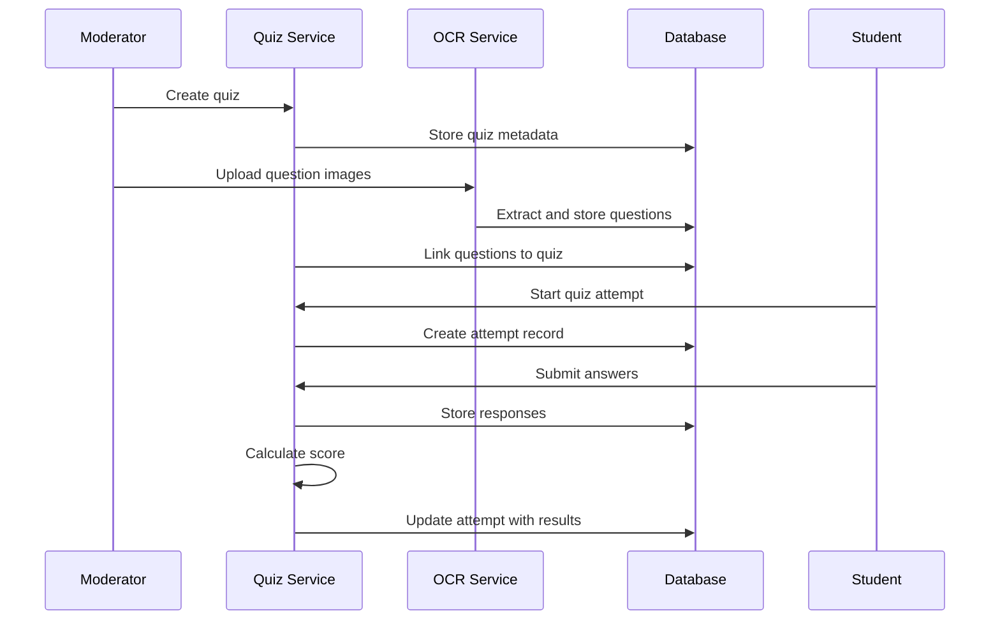

# 📝 Quizzes API

## Overview

The Quiz API provides comprehensive quiz management functionality including creation, participation, grading, and analytics for the TestLoom platform.

## Quiz Management Flow

