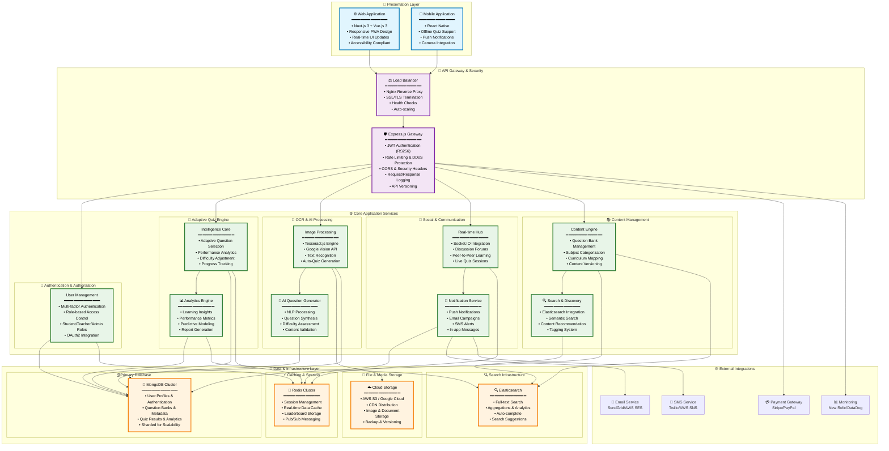

# 🏗️ TestLoom System Architecture

## 🎯 System Overview

```mermaid
graph TB
    %% Styling definitions
    classDef presentation fill:#e1f5fe,stroke:#0277bd,stroke-width:3px,color:#000
    classDef gateway fill:#f3e5f5,stroke:#7b1fa2,stroke-width:3px,color:#000
    classDef services fill:#e8f5e8,stroke:#2e7d32,stroke-width:3px,color:#000
    classDef data fill:#fff3e0,stroke:#f57c00,stroke-width:3px,color:#000
    classDef connections stroke:#424242,stroke-width:2px
    
    %% Presentation Layer
    subgraph PRESENTATION ["🎨 Presentation Layer"]
        direction TB
        WEB["🌐 Web Application<br/>━━━━━━━━━━━━━━━<br/>• Nuxt.js 3 + Vue.js 3<br/>• Responsive PWA Design<br/>• Real-time UI Updates<br/>• Accessibility Compliant"]
        MOBILE["📱 Mobile Application<br/>━━━━━━━━━━━━━━━<br/>• React Native<br/>• Offline Quiz Support<br/>• Push Notifications<br/>• Camera Integration"]
    end
    
    %% API Gateway Layer
    subgraph GATEWAY_LAYER ["🚪 API Gateway & Security"]
        direction TB
        GATEWAY["🛡️ Express.js Gateway<br/>━━━━━━━━━━━━━━━<br/>• JWT Authentication (RS256)<br/>• Rate Limiting & DDoS Protection<br/>• CORS & Security Headers<br/>• Request/Response Logging<br/>• API Versioning"]
        LB["⚖️ Load Balancer<br/>━━━━━━━━━━━━━━━<br/>• Nginx Reverse Proxy<br/>• SSL/TLS Termination<br/>• Health Checks<br/>• Auto-scaling"]
    end
    
    %% Core Services Layer
    subgraph SERVICES ["⚙️ Core Application Services"]
        direction TB
        
        subgraph AUTH_SERVICE ["🔐 Authentication & Authorization"]
            AUTH["User Management<br/>━━━━━━━━━━━━━━━<br/>• Multi-factor Authentication<br/>• Role-based Access Control<br/>• Student/Teacher/Admin Roles<br/>• OAuth2 Integration"]
        end
        
        subgraph QUIZ_SERVICE ["🧠 Adaptive Quiz Engine"]
            QUIZ["Intelligence Core<br/>━━━━━━━━━━━━━━━<br/>• Adaptive Question Selection<br/>• Performance Analytics<br/>• Difficulty Adjustment<br/>• Progress Tracking"]
            ANALYTICS["📊 Analytics Engine<br/>━━━━━━━━━━━━━━━<br/>• Learning Insights<br/>• Performance Metrics<br/>• Predictive Modeling<br/>• Report Generation"]
        end
        
        subgraph OCR_SERVICE ["📸 OCR & AI Processing"]
            OCR["Image Processing<br/>━━━━━━━━━━━━━━━<br/>• Tesseract.js Engine<br/>• Google Vision API<br/>• Text Recognition<br/>• Auto-Quiz Generation"]
            AI["🤖 AI Question Generator<br/>━━━━━━━━━━━━━━━<br/>• NLP Processing<br/>• Question Synthesis<br/>• Difficulty Assessment<br/>• Content Validation"]
        end
        
        subgraph SOCIAL_SERVICE ["💬 Social & Communication"]
            SOCIAL["Real-time Hub<br/>━━━━━━━━━━━━━━━<br/>• Socket.IO Integration<br/>• Discussion Forums<br/>• Peer-to-Peer Learning<br/>• Live Quiz Sessions"]
            NOTIF["🔔 Notification Service<br/>━━━━━━━━━━━━━━━<br/>• Push Notifications<br/>• Email Campaigns<br/>• SMS Alerts<br/>• In-app Messages"]
        end
        
        subgraph CONTENT_SERVICE ["📚 Content Management"]
            CONTENT["Content Engine<br/>━━━━━━━━━━━━━━━<br/>• Question Bank Management<br/>• Subject Categorization<br/>• Curriculum Mapping<br/>• Content Versioning"]
            SEARCH["🔍 Search & Discovery<br/>━━━━━━━━━━━━━━━<br/>• Elasticsearch Integration<br/>• Semantic Search<br/>• Content Recommendation<br/>• Tagging System"]
        end
    end
    
    %% Data & Infrastructure Layer
    subgraph DATA_LAYER ["💾 Data & Infrastructure Layer"]
        direction TB
        
        subgraph PRIMARY_DB ["🗄️ Primary Database"]
            MONGO["🍃 MongoDB Cluster<br/>━━━━━━━━━━━━━━━<br/>• User Profiles & Authentication<br/>• Question Banks & Metadata<br/>• Quiz Results & Analytics<br/>• Sharded for Scalability"]
        end
        
        subgraph CACHE_LAYER ["⚡ Caching & Session"]
            REDIS["💎 Redis Cluster<br/>━━━━━━━━━━━━━━━<br/>• Session Management<br/>• Real-time Data Cache<br/>• Leaderboard Storage<br/>• Pub/Sub Messaging"]
        end
        
        subgraph STORAGE_LAYER ["📁 File & Media Storage"]
            FILES["☁️ Cloud Storage<br/>━━━━━━━━━━━━━━━<br/>• AWS S3 / Google Cloud<br/>• CDN Distribution<br/>• Image & Document Storage<br/>• Backup & Versioning"]
        end
        
        subgraph SEARCH_DB ["🔍 Search Infrastructure"]
            ELASTIC["🔍 Elasticsearch<br/>━━━━━━━━━━━━━━━<br/>• Full-text Search<br/>• Aggregations & Analytics<br/>• Auto-complete<br/>• Search Suggestions"]
        end
    end
    
    %% External Services
    subgraph EXTERNAL ["🌐 External Integrations"]
        direction TB
        PAYMENT["💳 Payment Gateway<br/>Stripe/PayPal"]
        EMAIL["📧 Email Service<br/>SendGrid/AWS SES"]
        SMS["📱 SMS Service<br/>Twilio/AWS SNS"]
        MONITOR["📊 Monitoring<br/>New Relic/DataDog"]
    end
    
    %% Connections
    WEB --> LB
    MOBILE --> LB
    LB --> GATEWAY
    
    GATEWAY --> AUTH
    GATEWAY --> QUIZ
    GATEWAY --> OCR
    GATEWAY --> SOCIAL
    GATEWAY --> CONTENT
    
    QUIZ --> ANALYTICS
    OCR --> AI
    SOCIAL --> NOTIF
    CONTENT --> SEARCH
    
    AUTH --> MONGO
    AUTH --> REDIS
    QUIZ --> MONGO
    QUIZ --> REDIS
    ANALYTICS --> MONGO
    ANALYTICS --> ELASTIC
    OCR --> FILES
    OCR --> MONGO
    AI --> MONGO
    SOCIAL --> REDIS
    NOTIF --> REDIS
    CONTENT --> MONGO
    CONTENT --> ELASTIC
    SEARCH --> ELASTIC
    
    GATEWAY --> PAYMENT
    NOTIF --> EMAIL
    NOTIF --> SMS
    GATEWAY --> MONITOR
    
    %% Apply styles
    class WEB,MOBILE presentation
    class GATEWAY,LB gateway
    class AUTH,QUIZ,OCR,SOCIAL,CONTENT,ANALYTICS,AI,NOTIF,SEARCH services
    class MONGO,REDIS,FILES,ELASTIC data
```

