# 🎯 TestLoom System Architecture

## 🏗️ System Architecture

TestLoom follows a **3-tier architecture** ensuring scalability, security, and maintainability:

```mermaid
graph TB

    %% User Layer
    USERS["👥 University Students<br/>━━━━━━━━━━━━━━━━━━━━━━━<br/>• Browse Questions by Subject/Chapter<br/>• Take Timed Practice Quizzes<br/>• Upload Question Papers (OCR)<br/>• Participate in Discussions"]
    
    %% Frontend Layer
    subgraph FRONTEND [" 🌐 PRESENTATION LAYER "]
        WEB["📱 Web Application<br/>━━━━━━━━━━━━━━━━━━━━━━━<br/>• Nuxt.js 3 + Vue.js 3<br/>• Responsive Design<br/>• Interactive Quiz Interface<br/>• Real-time Chat UI"]
    end
    
    %% Backend Layer
    subgraph BACKEND [" ⚙️ APPLICATION LAYER "]
        API["🔌 REST API Server<br/>━━━━━━━━━━━━━━━━━━━━━━━<br/>• Node.js + Express.js<br/>• JWT Authentication<br/>• Role-based Access Control<br/>• Question Management APIs"]
        
        REALTIME["💬 Real-time Engine<br/>━━━━━━━━━━━━━━━━━━━━━━━<br/>• Socket.IO Integration<br/>• Live Discussions<br/>• Collaborative Features<br/>• Instant Notifications"]
        
        OCR["📸 OCR Processing<br/>━━━━━━━━━━━━━━━━━━━━━━━<br/>• Tesseract.js / Google Vision<br/>• Image to Text Conversion<br/>• Question Paper Digitization<br/>• Auto-formatting"]
        
        QUIZ["🧠 Quiz Engine<br/>━━━━━━━━━━━━━━━━━━━━━━━<br/>• Adaptive Question Selection<br/>• Timed Practice Sessions<br/>• Performance Analytics<br/>• Progress Tracking"]
    end
    
    %% Database Layer
    subgraph DATABASE [" 💾 DATA LAYER "]
        MONGO["🍃 MongoDB Database<br/>━━━━━━━━━━━━━━━━━━━━━━━<br/>• User Profiles & Authentication<br/>• Question Bank (MCQ + Fill-in-blank)<br/>• Quiz Results & Analytics<br/>• Discussion Threads"]
    end
    
    %% External Services
    subgraph EXTERNAL [" 🌐 EXTERNAL SERVICES "]
        CLOUD["☁️ Cloud Deployment<br/>━━━━━━━━━━━━━━━━━━━━━━━<br/>• AWS / Azure Platform<br/>• Scalable Hosting<br/>• Auto-scaling & Load Balancing"]
        VISION["👁️ Google Vision API<br/>━━━━━━━━━━━━━━━━━━━━━━━<br/>• Advanced OCR Processing<br/>• Text Recognition<br/>• Document Analysis"]
    end
    
    %% Enhanced Connections with consistent arrow styles and labels
    USERS ===>|"HTTP/HTTPS<br/>Requests"| WEB
    WEB ==>|"REST API<br/>Calls"| API
    WEB ==>|"WebSocket<br/>Connection"| REALTIME
    API ==>|"Image<br/>Processing"| OCR
    API ==>|"Quiz<br/>Generation"| QUIZ
    API ==>|"CRUD<br/>Operations"| MONGO
    REALTIME ==>|"Store Chat<br/>Messages"| MONGO
    OCR ==>|"Save Digitized<br/>Questions"| MONGO
    OCR -.->|"External API<br/>Integration"| VISION
    QUIZ ==>|"Analytics<br/>Data"| MONGO
    API -.->|"Application<br/>Deployment"| CLOUD
    
    %% Apply consistent styles to all components
    class USERS userLayer
    class WEB frontend
    class API,REALTIME,OCR,QUIZ backend
    class MONGO database
    class CLOUD,VISION external
    
    %% Enhanced subgraph styling
    class FRONTEND,BACKEND,DATABASE,EXTERNAL subgraphStyle
```

---

## 🔧 Core Features Implementation

### 🎯 **1. Question Management System**
- **Centralized Repository**: Organized by semester, subject, and chapter
- **Search & Filter**: Quick access to relevant questions
- **Categorization**: MCQs and fill-in-the-blank questions
- **Version Control**: Track question updates and modifications

### 📸 **2. OCR Integration**
- **Image Upload**: Drag-and-drop interface for question papers
- **Text Extraction**: Tesseract.js for client-side processing
- **Google Vision API**: Enhanced accuracy for complex layouts
- **Auto-formatting**: Convert extracted text to quiz-ready format

### 🧠 **3. Adaptive Quiz Engine**
- **Personalized Practice**: Questions based on performance history
- **Timed Sessions**: Simulate real exam conditions
- **Difficulty Adjustment**: Adaptive question selection
- **Performance Analytics**: Track progress and identify weak areas

### 💬 **4. Real-time Collaboration**
- **Discussion Forums**: Chapter and question-specific threads
- **Live Chat**: Instant doubt resolution
- **Peer Learning**: Student-to-student knowledge sharing
- **Moderated Environment**: Secure and focused discussions

---

## 🔐 Security Architecture

### 🛡️ **Security Measures**
- **Authentication**: JWT-based secure authentication
- **Authorization**: Role-based access control (Student/Admin/Moderator)
- **Data Encryption**: HTTPS for data transmission
- **Input Validation**: Prevent injection attacks
- **Rate Limiting**: Protect against abuse

---

