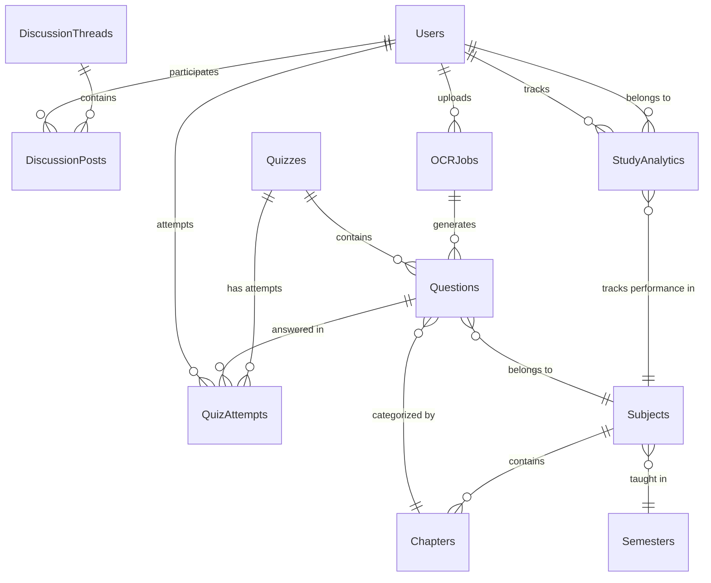

# 🗄️ TestLoom Database Schema

> *MongoDB 8.x NoSQL Database Design for Centralized Question Management*

TestLoom uses **MongoDB 8.x** as its primary NoSQL database, optimized for storing organized question banks, user profiles, quiz records, and real-time discussion data. The schema is designed to support the core requirements outlined in the project proposal.

## 🎯 Design Principles

Based on the TestLoom proposal requirements:
- **Categorization by Semester, Subject, and Chapter** for easy retrieval
- **Indexing optimization** for fast search speed during quiz creation
- **Scalable structure** to accommodate growing question banks
- **Performance-first design** for real-time quiz and discussion features

## 📊 Collections Overview & Relationships

