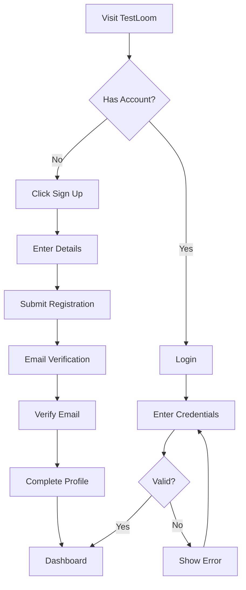
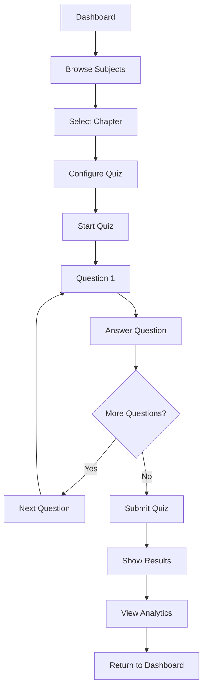
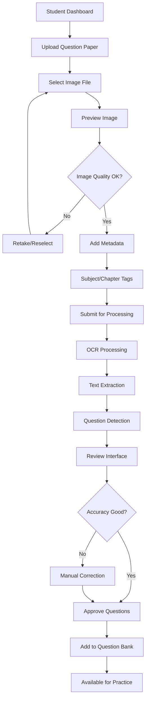
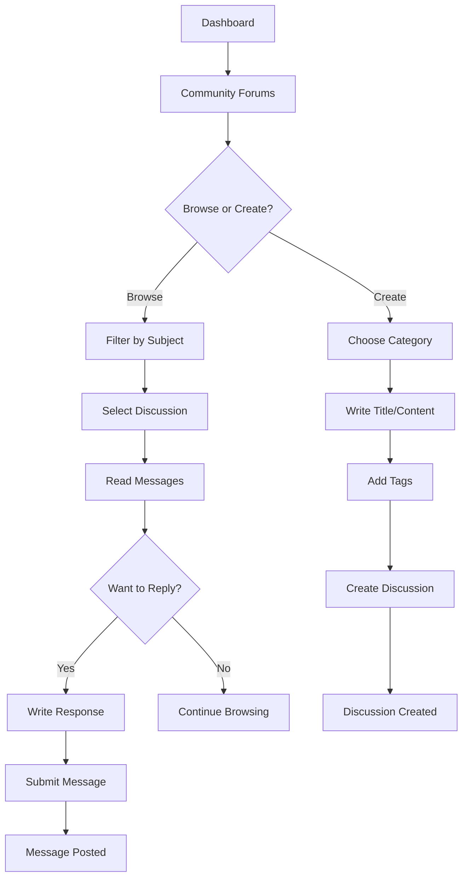
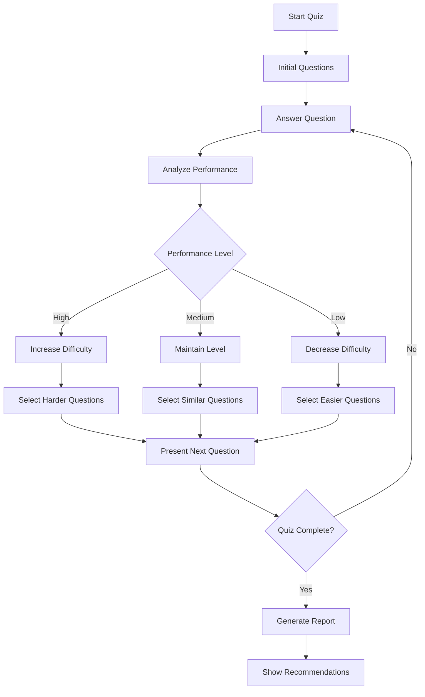
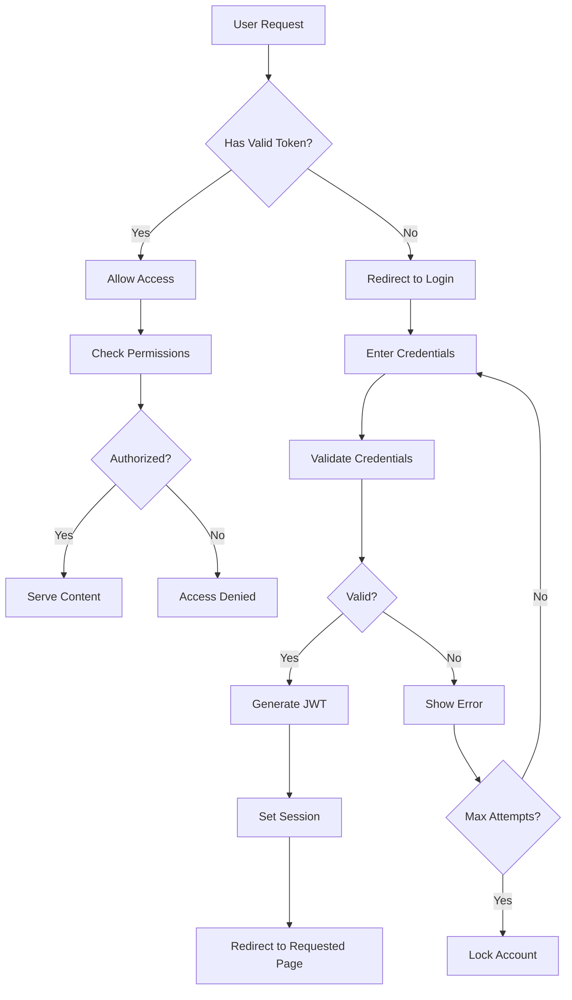
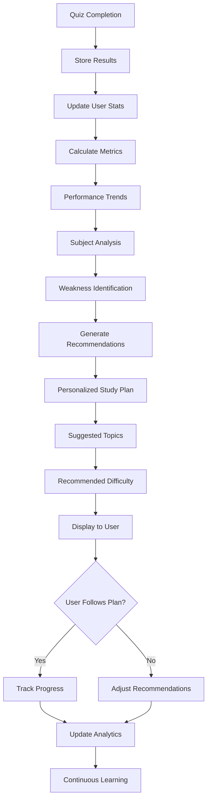
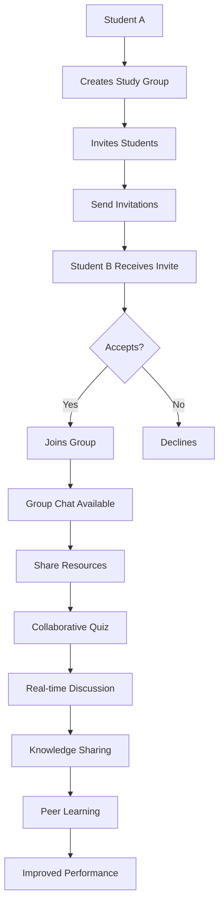
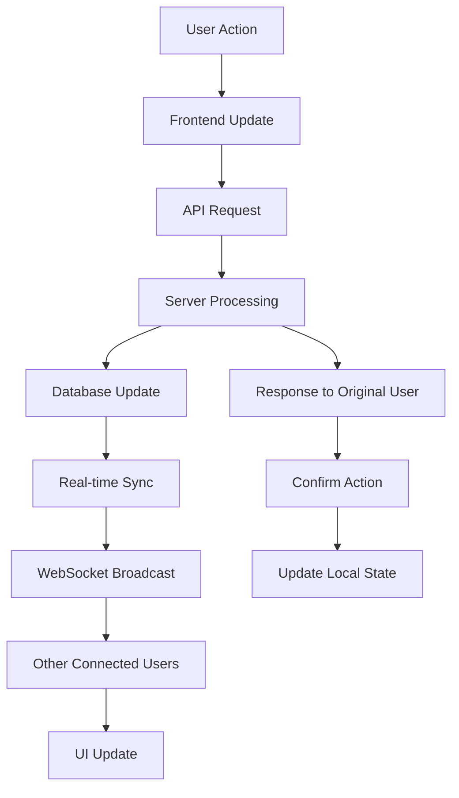

# 📈 User Flow Diagrams

This document outlines the key user journeys and interaction flows within TestLoom.

## 🎯 Student Registration Flow

## 📚 Quiz Taking Flow

## 📷 OCR Upload Flow

## 💬 Discussion Participation Flow

## 🎓 Adaptive Learning Flow

## 🔐 Authentication Flow

## 📊 Performance Analytics Flow

## 👥 Collaboration Flow

## 🔄 Data Synchronization Flow

---

*These diagrams represent the core user flows in TestLoom. For implementation details, see our [Core Architecture](./core-architecture.png).*
