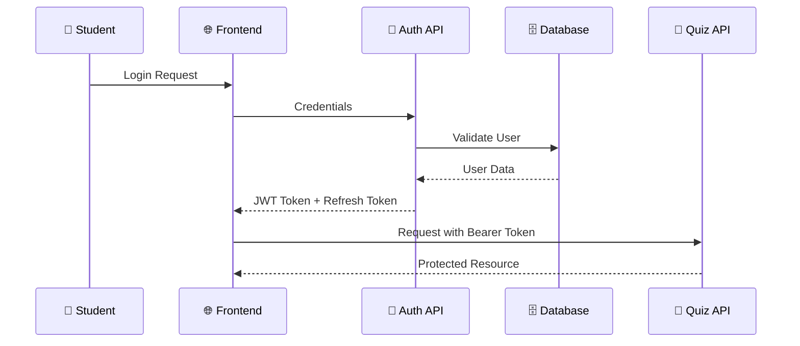
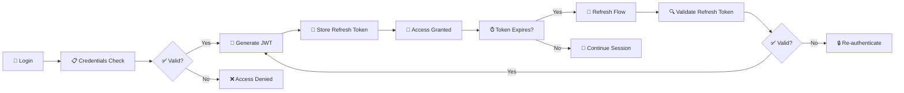
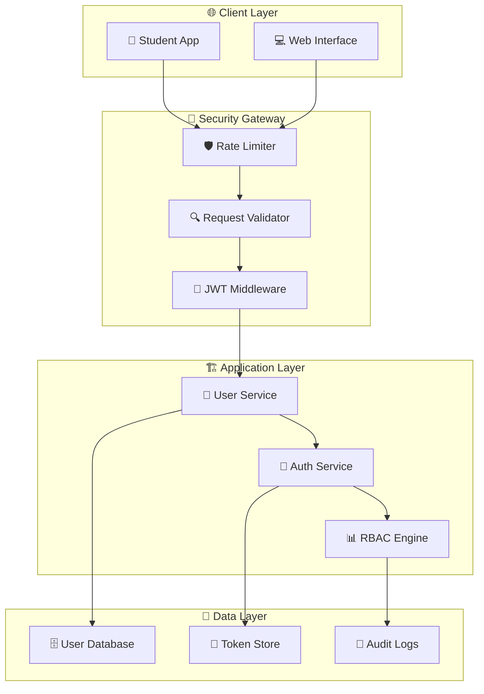
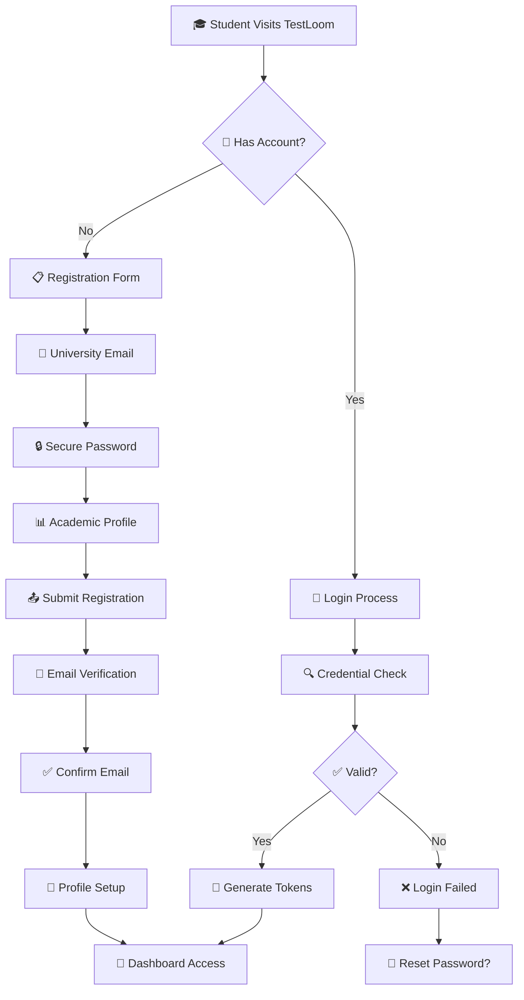
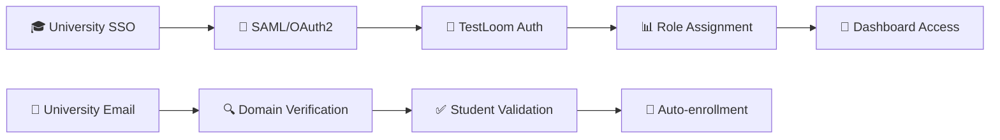
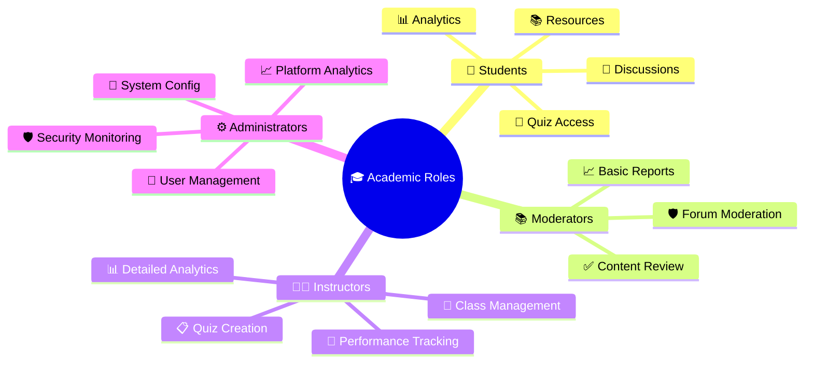

# <div align="center">🔐 Authentication & Security</div>

<div align="center">

**Enterprise-Grade Security for Educational Excellence**

*Protecting student data while enabling seamless learning experiences*

---


</div>

---

## 🌟 Security Vision

TestLoom's authentication system ensures **secure, seamless access** to educational resources while protecting sensitive student data and maintaining academic integrity. Built with university-grade security standards that scale with your learning journey.

### 🎯 **Why Our Security Matters**

<table>
<tr>
<td width="33%" align="center">

### 🛡️ **Academic Integrity**
Protecting quiz content and preventing unauthorized access to examination materials

</td>
<td width="33%" align="center">

### 🔒 **Student Privacy**
GDPR-compliant data protection with encrypted storage and secure transmission

</td>
<td width="33%" align="center">

### ⚡ **Seamless Experience**
Single sign-on with role-based access that doesn't interrupt the learning flow

</td>
</tr>
</table>

---

## ✨ Security Features

<div align="center">

### 🔐 **JWT Authentication (RS256)**



</div>

### 🎪 **Role-Based Access Control**

<table>
<tr>
<td width="25%">

#### 👤 **Student**
- Access question bank
- Take quizzes & practice
- Join discussions
- View personal analytics

</td>
<td width="25%">

#### 📚 **Moderator**
- Review OCR uploads
- Moderate discussions
- Validate questions
- Access basic analytics

</td>
<td width="25%">

#### 👨‍🏫 **Instructor**
- Create question sets
- Manage student groups
- Access detailed analytics
- Configure quiz settings

</td>
<td width="25%">

#### ⚙️ **Admin**
- System configuration
- User management
- Platform analytics
- Security monitoring

</td>
</tr>
</table>

### 🔄 **Token Management Flow**



---

## 🛡️ Security Architecture

<div align="center">



</div>

---

## 🔧 Authentication Implementation

### 🎯 **Student Registration Flow**

<div align="center">



</div>

### 🔐 **Password Security Standards**

<table>
<tr>
<td width="50%">

#### 🛡️ **Requirements**
- ✅ Minimum 8 characters
- ✅ Uppercase & lowercase letters
- ✅ Numbers & special characters
- ✅ No common dictionary words
- ✅ No personal information

</td>
<td width="50%">

#### 🔒 **Security Features**
- 🔐 bcrypt hashing (cost factor 12)
- 🔄 Password history (last 5)
- ⏰ Forced reset every 90 days
- 🚫 Account lockout (5 attempts)
- 📧 Breach notifications

</td>
</tr>
</table>

---

## 🔍 Security Monitoring

### 📊 **Real-time Security Dashboard**

<div align="center">

| 🎯 **Security Metric** | 📈 **Monitoring** | 🚨 **Alerts** |
|:----------------------|:------------------|:---------------|
| **Failed Login Attempts** | Real-time tracking | > 5 attempts/minute |
| **Suspicious Activity** | Behavior analysis | Unusual access patterns |
| **Token Anomalies** | JWT validation | Invalid/expired tokens |
| **Data Access** | RBAC violations | Unauthorized endpoints |

</div>

### 🛡️ **Security Best Practices**

<table>
<tr>
<td width="50%">

#### 🔐 **Data Protection**
- 🔒 **Encryption at Rest**: AES-256
- 🌐 **Encryption in Transit**: TLS 1.3
- 🗄️ **Database Security**: MongoDB encryption
- 🔑 **Key Management**: Hardware security modules

</td>
<td width="50%">

#### 🚨 **Threat Prevention**
- 🔄 **Rate Limiting**: API protection
- 🎭 **CORS Policy**: Strict domain control
- 📝 **Input Validation**: Comprehensive sanitization

</td>
</tr>
</table>

---

## 🎓 University Integration

### 🏫 **Academic Authentication**



### 📚 **Academic Roles & Permissions**

<div align="center">



</div>

---

## 🔧 Integration Guide

### 🚀 **Quick Setup**

```bash
# Environment Configuration
JWT_SECRET_KEY=your-rs256-private-key
JWT_PUBLIC_KEY=your-rs256-public-key
JWT_ALGORITHM=RS256
JWT_EXPIRES_IN=15m
REFRESH_TOKEN_EXPIRES_IN=7d

# Security Settings
BCRYPT_ROUNDS=12
SESSION_TIMEOUT=24h
MAX_LOGIN_ATTEMPTS=5
LOCKOUT_DURATION=15m
```

### 📡 **API Integration**

```javascript
// Authentication Middleware
app.use('/api/protected', authenticateJWT, authorizeRole(['student', 'instructor']));

// Role-based Route Protection
router.get('/admin/analytics', requireRole('admin'), getAnalytics);
router.post('/quiz/create', requireRole(['instructor', 'admin']), createQuiz);
router.get('/questions', requireRole(['student', 'instructor', 'admin']), getQuestions);
```

---


