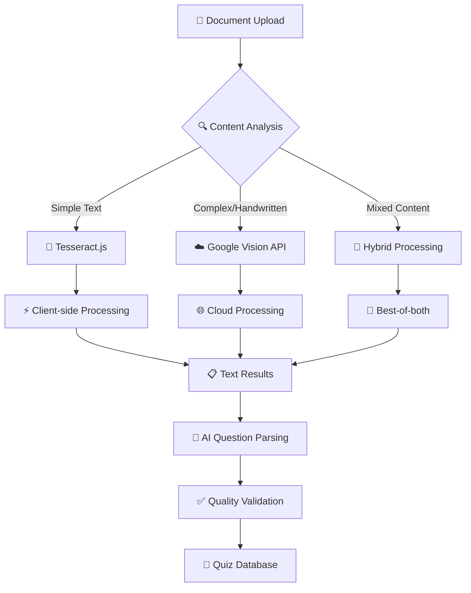
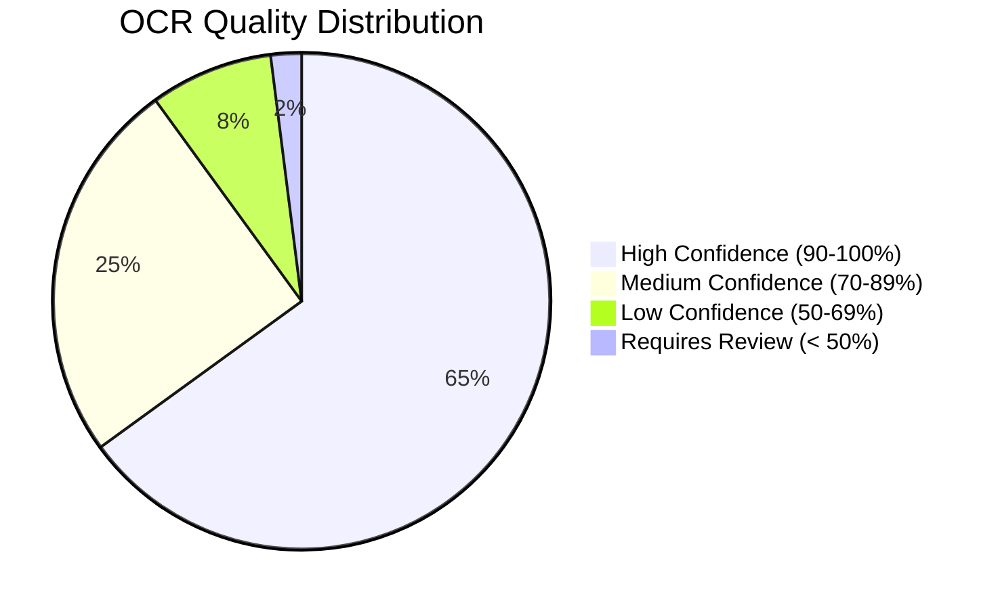
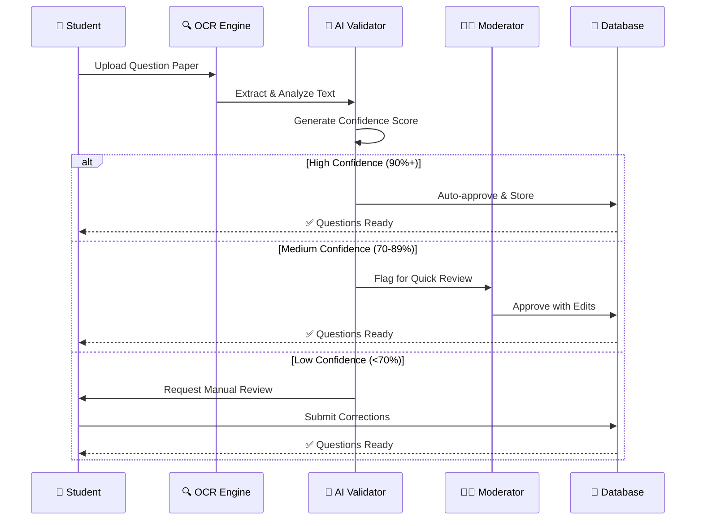
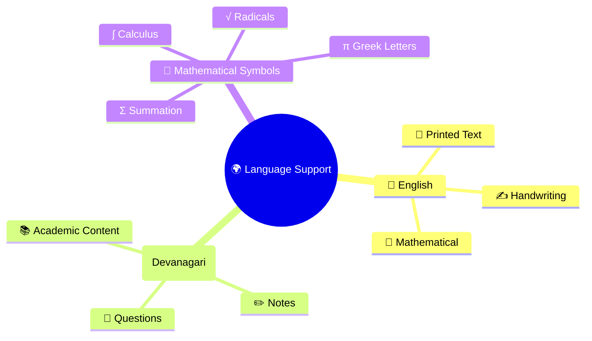
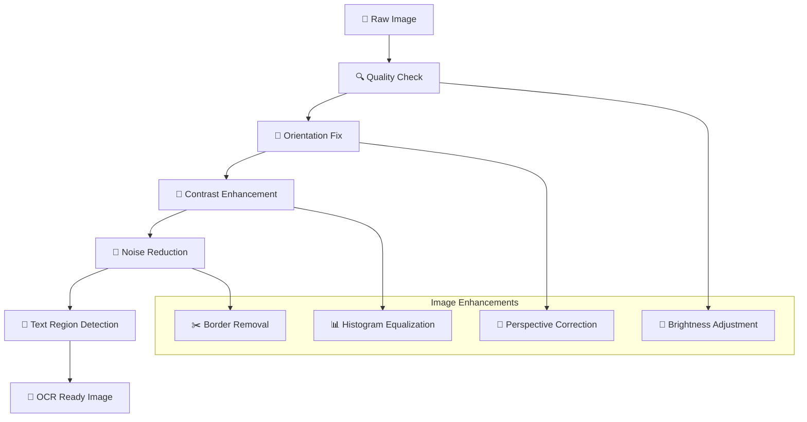
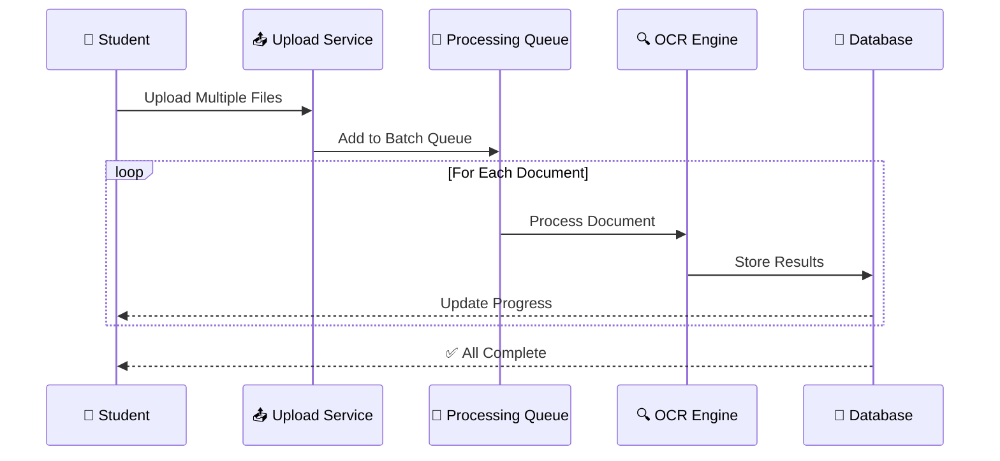

# 
📸 OCR & Document Intelligence

**Transform Physical Papers into Digital Learning**

*Converting handwritten notes and printed exams into interactive quiz experiences*

---

---

## 🌟 OCR Vision

TestLoom's **Optical Character Recognition** system revolutionizes how students digitize study materials. Upload any question paper, handwritten notes, or textbook pages and watch them transform into interactive, searchable quiz content.

### 🎯 **Why OCR Transforms Learning**

<table>
<tr>
<td width="33%" align="center">

### ⚡ **Instant Digitization**
Convert physical study materials to digital format in seconds, not hours

</td>
<td width="33%" align="center">

### 🎯 **Smart Recognition**
Advanced AI identifies questions, options, and answers automatically

</td>
<td width="33%" align="center">

### 📚 **Growing Library**
Every upload expands the question bank for the entire student community

</td>
</tr>
</table>

### 🧠 **Intelligent Processing Pipeline**

```mermaid
graph LR
    A[📸 Image Upload] --> B[🔍 Quality Check]
    B --> C[⚡ Pre-processing]
    C --> D[🤖 OCR Engine]
    D --> E[📝 Text Extraction]
    E --> F[🧠 AI Analysis]
    F --> G[❓ Question Detection]
    G --> H[✅ Validation]
    H --> I[💾 Database Storage]
    
    class A,B upload
    class C,D,E process
    class F,G,H ai
    class I storage
```

---

## 🔧 Dual OCR Engine System

### 🎭 **Smart Engine Selection**

### 🎪 **Engine Comparison**

<table>
<tr>
<td width="50%">

#### 📱 **Tesseract.js (Client-side)**

**🎯 Perfect for:**
- ✅ Printed textbooks & papers
- ✅ Privacy-sensitive content
- ✅ Offline processing
- ✅ Quick simple documents

**💡 Advantages:**
- 🔒 Complete privacy (no data upload)
- ⚡ Instant processing
- 💰 Zero API costs
- 🌐 Works offline

</td>
<td width="50%">

#### ☁️ **Google Vision API (Cloud)**

**🎯 Perfect for:**
- ✅ Handwritten notes
- ✅ Complex mathematical formulas
- ✅ Poor quality images
- ✅ Multi-language content

**💡 Advantages:**
- 🎯 Superior accuracy (98%+)
- 🧠 Advanced AI processing
- 📝 Handwriting recognition
- 🌍 Multi-language support

</td>
</tr>
</table>

---

## 📊 Quality Assurance System

### 🎯 **Confidence Scoring**

### 🔍 **Quality Metrics**

| 📊 **Confidence Level** | 🎯 **Accuracy Range** | 🔄 **Action Required** | ⏱️ **Review Time** |
|:------------------------|:----------------------|:----------------------|:-------------------|
| 🟢 **High (90-100%)** | Perfect recognition | ✅ Auto-approval | None |
| 🟡 **Medium (70-89%)** | Minor corrections needed | 👀 Quick review | 2-3 minutes |
| 🟠 **Low (50-69%)** | Significant edits required | ✏️ Manual editing | 5-8 minutes |
| 🔴 **Poor (< 50%)** | Complete re-processing | 🔄 Re-upload recommended | 10+ minutes |

### 🛡️ **Validation Pipeline**

---

### 🔤 **Multi-Language Support**

---

## 🎨 Image Processing Pipeline

### 📸 **Pre-processing Enhancement**

---

## 📈 Advanced Features

### 🤖 **AI-Powered Enhancements**

<table>
<tr>
<td width="50%">

#### 🧠 **Smart Question Parsing**
- ✅ Automatic question numbering
- ✅ Option detection (A, B, C, D)
- ✅ Answer key identification
- ✅ Difficulty level assessment

</td>
<td width="50%">

#### 📝 **Content Enhancement**
- ✅ Grammar correction suggestions
- ✅ Mathematical formula formatting
- ✅ Image diagram extraction
- ✅ Topic categorization

</td>
</tr>
</table>

### 🔄 **Batch Processing**

---

