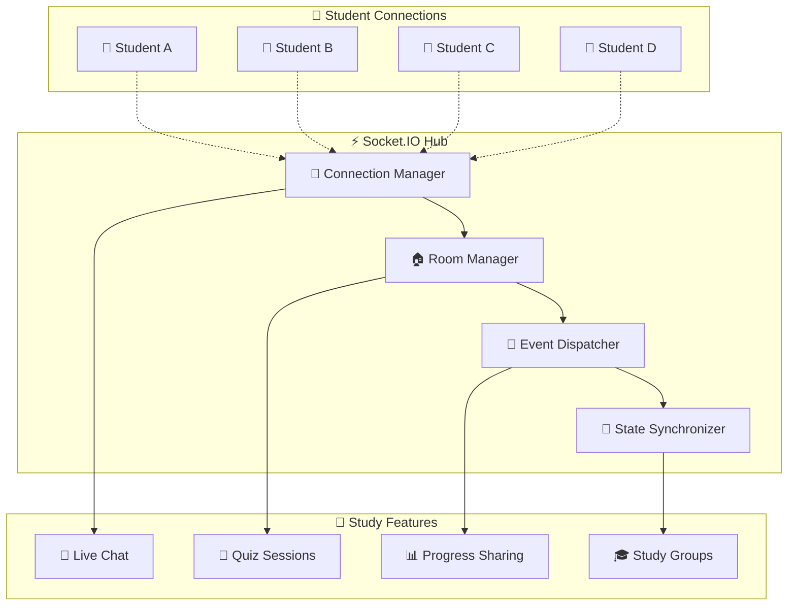
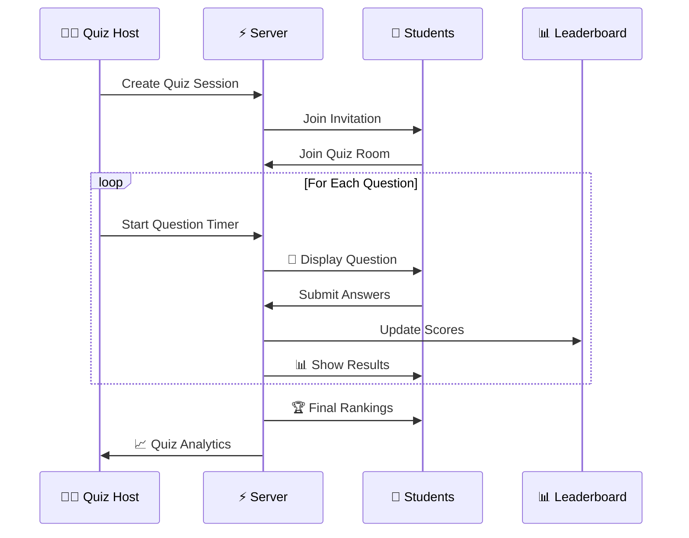
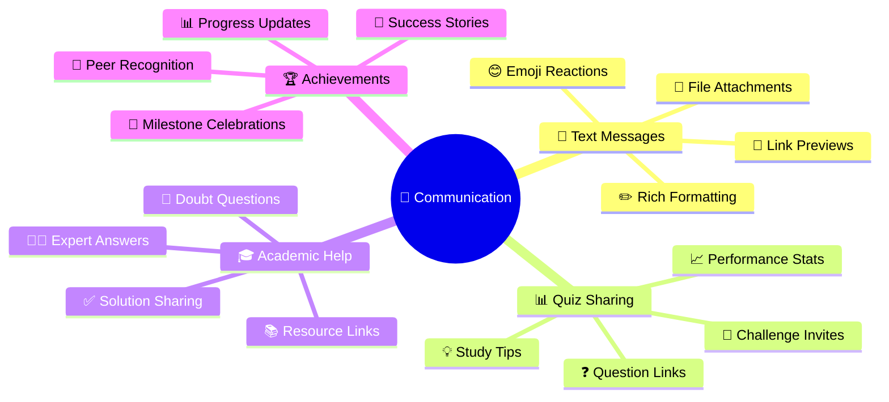
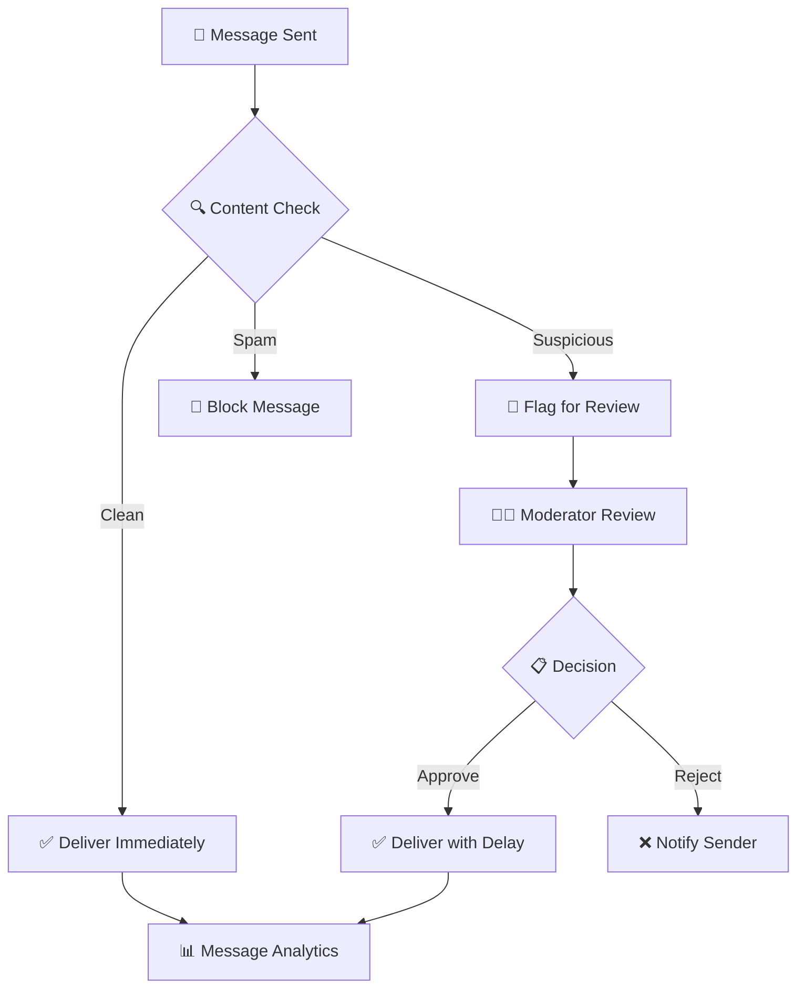
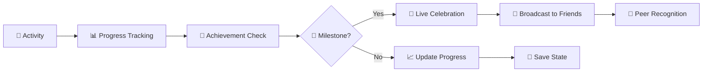
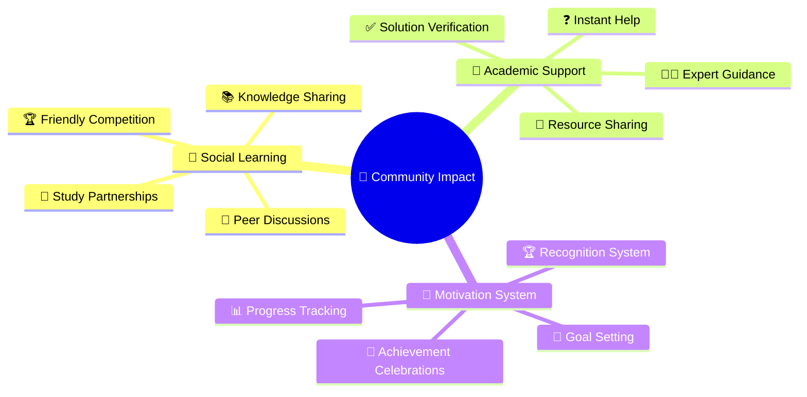

# 
⚡ Real-Time Collaboration

**Instant Learning Through Live Connections**

*Connecting students in real-time for collaborative exam preparation*

---

---

## 🌟 Real-Time Vision

TestLoom's **real-time collaboration** transforms isolated studying into an **engaging community experience**. Connect instantly with peers, share knowledge, and learn together through live discussions, collaborative quizzes, and instant doubt resolution.

### 🎯 **Why Real-Time Matters**

<table>
<tr>
<td width="33%" align="center">

### 💬 **Instant Doubt Resolution**
Get help immediately when stuck on difficult questions or concepts

</td>
<td width="33%" align="center">

### 👥 **Peer Learning**
Learn faster through collaborative discussions and knowledge sharing

</td>
<td width="33%" align="center">

### 🏆 **Competitive Practice**
Challenge friends in live quiz sessions for motivated learning

</td>
</tr>
</table>

---

## ✨ Live Features

### 🎪 **Real-Time Experiences**

| 🎯 **Feature** | 📱 **Experience** | 👥 **Collaboration Level** | ⚡ **Response Time** |
|:---------------|:------------------|:---------------------------|:-------------------|
| **Live Quiz Sessions** | Compete with friends | 2-50 participants | < 100ms |
| **Study Room Chat** | Instant messaging | Topic-based groups | < 50ms |
| **Doubt Resolution** | Q&A with peers | Expert-guided | < 200ms |
| **Progress Sharing** | Achievement updates | Social motivation | < 150ms |

### 🌐 **Connection Architecture**

---

## 🎮 Interactive Learning Experiences

### 🏆 **Live Quiz Competitions**

### 🎪 **Study Room Types**

<table>
<tr>
<td width="25%">

#### 📚 **Subject Rooms**
- Math & Calculus
- Physics & Chemistry
- Programming & CS
- English & Literature

**Perfect for:** Topic-specific discussions

</td>
<td width="25%">

#### ⏰ **Exam Prep Rooms**
- Final Exam Sprint
- Midterm Review
- Assignment Help
- Last-minute Doubts

**Perfect for:** Urgent preparation

</td>
<td width="25%">

#### 👥 **Study Groups**
- Private friend groups
- Class study sessions
- Project collaborations
- Peer tutoring

**Perfect for:** Close collaboration

</td>
<td width="25%">

#### 🏆 **Competition Rooms**
- Daily challenges
- Speed quiz contests
- Knowledge tournaments
- Achievement races

**Perfect for:** Motivated learning

</td>
</tr>
</table>

---

## 💬 Smart Communication System

### 🎯 **Message Types & Features**

### 🛡️ **Moderated Environment**

---

## 🎮 Gamified Learning

### 🏆 **Live Achievements System**

### 🎪 **Real-Time Competitions**

<table>
<tr>
<td width="50%">

#### ⚡ **Speed Challenges**
- 🏃‍♂️ **Quick Fire Round**: 30 questions in 10 minutes
- 🎯 **Accuracy Contest**: Highest correct percentage
- 🔥 **Streak Master**: Longest correct answer streak
- ⏰ **Lightning Round**: Beat the clock challenges

</td>
<td width="50%">

#### 👥 **Team Competitions**
- 🏆 **Class vs Class**: Inter-class competitions
- 📚 **Subject Champions**: Topic-wise tournaments
- 🤝 **Study Buddies**: Partner challenges
- 🌟 **Weekly Champions**: Regular competitions

</td>
</tr>
</table>

---

### 🤝 **Community Building**

